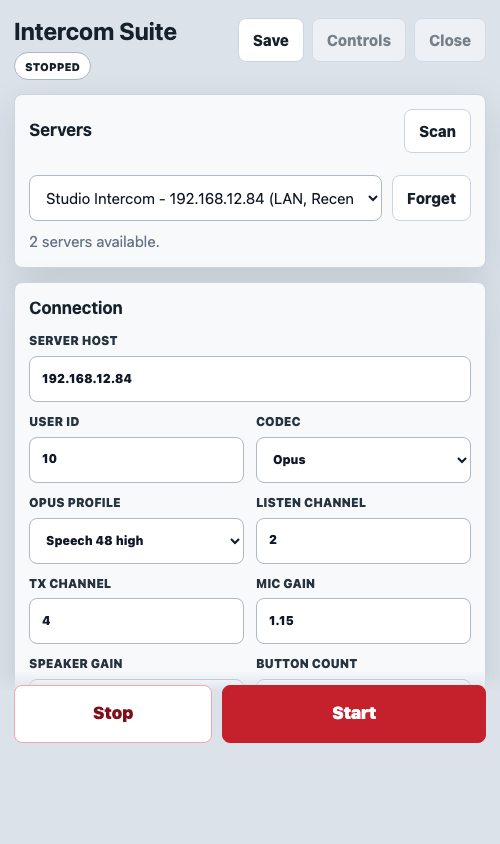
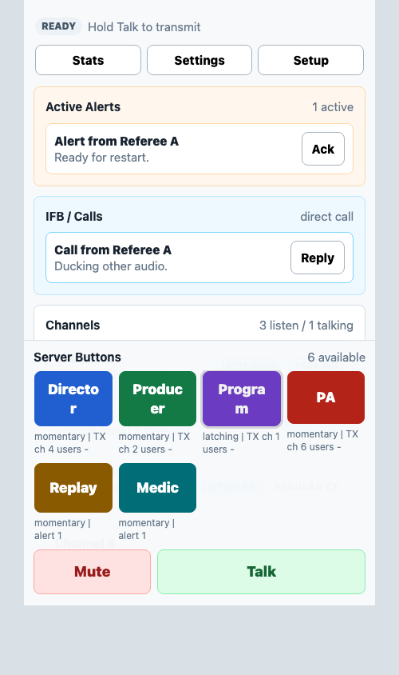
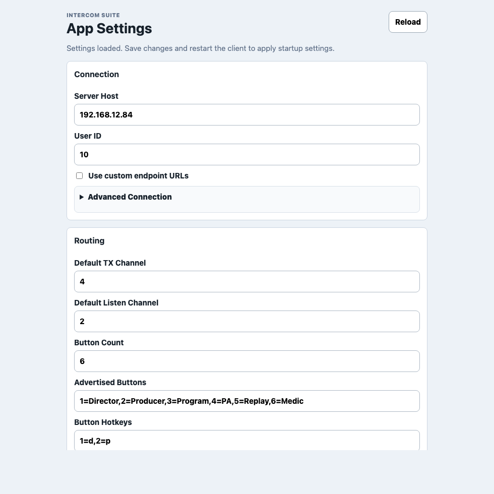
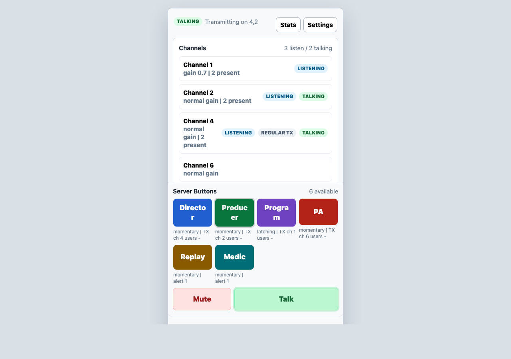
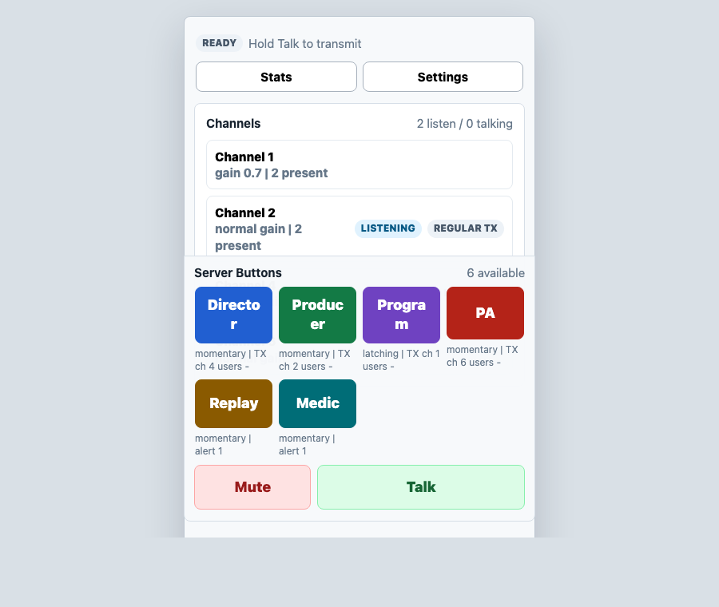
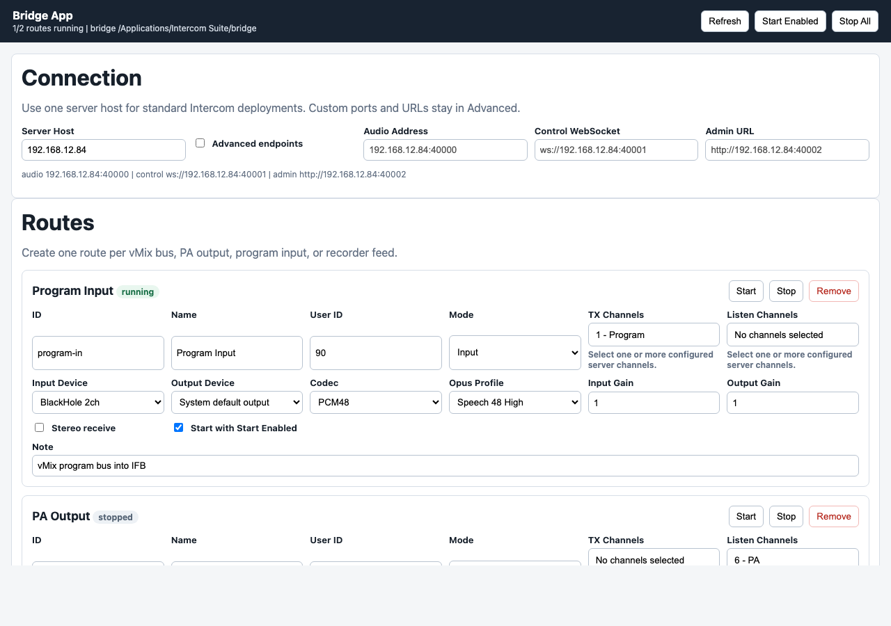

# Client UI Screenshots

These screenshots are generated from the checked-in UI assets with:

```sh
node tools/generate-client-ui-screenshots.mjs
```

The generator uses deterministic sample client/server state so the screenshots
can be reviewed without starting a live intercom server. The PNGs live under
`docs/assets/client-ui/`.

## Mobile Setup

The iOS/Android Tauri shell starts on the mobile setup page. Normal operators
enter one server host, choose a saved/discovered LAN server, and leave fixed
ports hidden unless advanced endpoints are enabled.



## Tauri Operator Console

Packaged Tauri clients use the shared operator console through Tauri IPC. The
main surface keeps active alerts, direct-call reply, server buttons, mute, and
talk controls in the operator path.



## Native App Settings

The native desktop app settings window is startup-oriented. It keeps the simple
server host, user, routing, button count, and advertised button controls visible
while custom endpoint URLs and deeper audio options stay behind advanced
sections.



## Desktop Local UI

The desktop local HTTP UI serves the same operator console over the local API.
The transport is different from packaged Tauri, but the operator layout remains
the same.



## Pi Browser UI

The Pi browser UI also serves the shared operator console. Unsupported live
desktop-only controls are hidden or disabled while talk, mute, channel, and
server-button controls remain consistent.



## Bridge App

The bridge app is not a push-to-talk surface. It is the multi-route launcher for
program inputs, PA outputs, recorder feeds, and other production audio bridge
routes.


